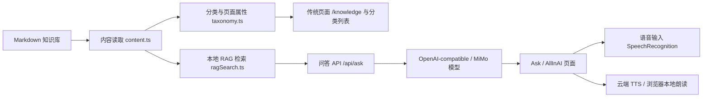

# 原型说明

## 1. 项目定位

本项目是一个 ISP 图像调试知识库 Web 原型，目标不是做通用博客，而是把工程调试知识整理成可检索、可引用、可对话的个人知识系统。

核心使用者是 ISP 图像调试工程师。典型场景包括：

- 遇到偏色、噪声、拖影、闪烁、过曝等问题时，快速找到排查路径。
- 学习某个平台或 sensor 的调试方法。
- 查询某个模块的参数含义、调试取舍和关联风险。
- 把原始手册、datasheet、工具说明和个人项目经验沉淀为可复用知识。

## 2. 原型体验

### 传统浏览

传统入口用于稳定阅读和导航：

- 平台：sensor / ISP / 方案 / 厂家主体页。
- 模块：AE、AWB、Gamma、NR、Sharpness、HDR 等。
- 问题：偏色、噪声大、拖影、闪烁、高光过曝、肤色不准等。
- 流程：平台调试流程、跨平台检查表、问题排查流程。
- 工具：ISP tuning tool、寄存器访问、导入导出方法等。

### RAG 问答

`/ask/` 先检索本地 `wiki/`，再把命中的知识片段发给大模型。回答需要带引用，方便回到原文核对。

### AllInAI 对话

`/allinai/` 是统一对话入口，适合用自然语言输入：

- “晚上画面很糊，车动起来还有拖尾，应该先查什么？”
- “我要学习 SC121AT 的 HDR 调试路线，从哪里开始？”
- “帮我找 FH833X AE 亮度相关资料和入口。”

页面会自动判断更像“现象排查”还是“知识库问答”，并使用不同提示词组织回答。

### 语音交互

语音功能包含三段：

1. 浏览器语音识别：把用户说的话写入输入框。
2. 停顿后发送：避免用户还没说完就提交；当前策略是持续听写，停顿约 2.4 秒后自动发送。
3. 语音播报：优先调用云端 TTS；若未配置或失败，则回退到浏览器本地朗读。

## 3. 功能架构

## 4. 页面与模块

| 模块 | 文件 | 作用 |
| --- | --- | --- |
| AllInAI | `src/pages/allinai.astro` | 命令行风格对话、语音输入、语音播报 |
| Ask | `src/pages/ask.astro` | 知识库问答页面 |
| Traditional | `src/pages/traditional.astro` | 传统分类导航 |
| Knowledge Page | `src/pages/knowledge/[...slug].astro` | Markdown 知识页渲染 |
| Knowledge Files | `src/pages/knowledge-files/[...path].ts` | 原始文件访问 |
| Ask API | `src/pages/api/ask.ts` | 本地检索 + LLM 回答 |
| TTS API | `src/pages/api/tts.ts` | 云端语音合成 |
| LLM Config | `src/lib/llm.ts` | 模型、TTS、密钥和请求封装 |
| RAG Search | `src/lib/ragSearch.ts` | 检索知识片段和构造上下文 |

## 5. 原型边界

当前原型优先解决“个人知识库本地使用”和“GitHub 展示结构”的问题，因此有几个边界：

- 不内置用户密钥，所有密钥通过环境变量配置。
- 不把原始资料默认打包进 Web 项目，使用 `KNOWLEDGE_ROOT` 指向知识库。
- 不替代人工判断，模型回答应回到引用页核对。
- 不把一次项目经验直接上升为通用规律，案例必须保留上下文。

## 6. 后续可扩展方向

- 增加知识库 Lint：检查页面属性、来源、双向链接和命名规范。
- 增加 GitHub Pages / 静态部署模式下的示例知识库。
- 增加语音设置面板：语速、音色、自动发送延迟、云端/本地优先级。
- 增加导入向导：从 PDF、会议记录、调试日志生成待审核知识草稿。
- 增加案例库视图：按平台、现象、模块和调试结论筛选真实项目记录。
