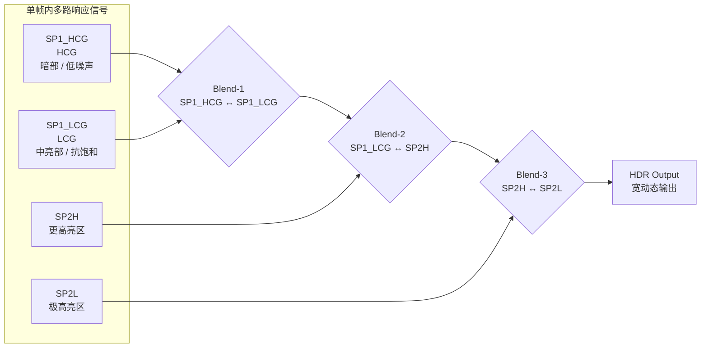

# HDR

HDR 用于把不同灵敏度或曝光条件下获取的多路 RAW 信号进行合成，以获得更宽的动态范围。

## 页面属性
- 类型：通用模块
- 厂家：Sony
- 平台：[[wiki/platforms/ISX031|ISX031]]
- 模块：HDR 成像
- 场景：大光比、逆光、高亮与暗部共存场景
- 适用范围：当前以 [[wiki/platforms/ISX031|ISX031]] 为主，后续可扩展为跨平台 HDR 调试知识

## 适用范围
- 平台：[[wiki/platforms/ISX031|ISX031]]
- 模块：HDR 成像
- 场景：大光比、逆光、高亮与暗部共存场景

## 技术实现总结
- ISX031 的 HDR 不是单纯“压一条曲线”，而是把多路不同响应特性的子像素信号合成为一路输出
- 当前资料明确给出 4 路参与信号：`SP1_HCG`、`SP1_LCG`、`SP2H`、`SP2L`
- 整个合成链分成 3 段切换：`SP1_HCG↔SP1_LCG`、`SP1_LCG↔SP2H`、`SP2H↔SP2L`
- 每一段都要决定三件事：什么时候切、按什么基准切、切过来之后怎样把亮度和颜色接平

## 信号路线示意图

- `SP1_HCG` 主要承担暗部低噪声成像
- `SP1_LCG` 主要承担中亮部并提升抗饱和能力
- `SP2H` 继续向高亮区扩展动态范围
- `SP2L` 负责守住极高亮区域层次
- 三段合成对应 `SP1`、`SP12`、`SP2` 三个复合区

## 核心要点
- ISX031 使用 `SP1_HCG`、`SP1_LCG`、`SP2H`、`SP2L` 四路信号合成 HDR 图像
- 合成过程中存在三段切换：`SP1_HCG↔SP1_LCG`、`SP1_LCG↔SP2H`、`SP2H↔SP2L`
- HDR 调整的核心是：选择切换方法、设置合成阈值、设置合成增益、做图像质量评估

## 技术实现拆解
### 1. 多路信号输入
- `SP1_HCG` / `SP1_LCG` 可以理解为同一曝光链上不同转换增益特性的两路信号
- `SP2H` / `SP2L` 则进一步把动态范围向更亮端拉开
- 这样做的目的不是让所有亮度都靠单一路信号承受，而是让不同亮度区间分别交给更合适的信号来源

### 2. 三段式合成切换
- 第一段：`SP1_HCG` 与 `SP1_LCG` 之间切换，重点是兼顾暗部噪声和中亮部饱和能力
- 第二段：`SP1_LCG` 与 `SP2H` 之间切换，重点是把普通亮区过渡到更高动态范围区间
- 第三段：`SP2H` 与 `SP2L` 之间切换，重点是守住最亮区域的层次
- 所以 HDR 调试里最关键的不是“开或关”，而是三段交界是否连续

### 3. 切换基准选择
- 资料中给出 Pixel Value Switching 与 Luminance Switching 两类思路
- Pixel Value Switching 更偏直接按像素值/原始信号关系切换，通常颜色一致性更容易控制
- Luminance Switching 更偏亮度观感连续，但复合区更容易引入偏色和 SNR 下降
- 这也是为什么 HDR 调试经常不是先看全局亮不亮，而是先看复合区脏不脏、偏不偏

### 4. 合成阈值设置
- 三段切换都需要各自的上下阈值，决定前一路信号何时开始退出、后一路何时开始接管
- 阈值设得过高，前一路接近饱和的内容还会被带进输出，容易出现高光顶死、接缝突变
- 阈值设得过低，后一路过早参与，虽然高光保留更强，但噪声、偏色和亮度不连续也更容易暴露

### 5. 灵敏度比与合成增益
- 多路 HDR 信号本身响应不同，所以必须靠灵敏度比和合成增益把它们拉到同一输出逻辑下
- 灵敏度比决定动态范围能拉开多少
- 合成增益决定各段接缝能不能接平
- 如果这两部分没配好，即使阈值位置看起来对，复合区也会出现发灰、色偏或亮度断层

### 6. 图像质量评估重点
- 高光是否保住层次
- 暗部是否因为错误切换引入额外噪声
- 三段交界处是否出现偏色、颗粒、脏边、闪点
- 画面边缘是否因为 [[wiki/modules/ISX031_Pixel Shading Compensation|Pixel Shading Compensation]] 或光学系统差异放大复合问题

## 调试方法
1. 先确认当前 HDR 问题是高光溢出、暗部堵塞，还是合成区偏色/噪声。
2. 选择信号切换方法：优先从 Pixel Value Switching 开始；若复合区着色难以接受，再评估 Luminance Switching。
3. 设置三组复合区域的上下阈值：`SP1`、`SP12`、`SP2`。
4. 调整合成增益，使各子像素在亮度-输出关系上尽量保持线性。
5. 若存在高温或模拟增益不足情况，适当降低合成阈值，避免饱和像素进入 HDR 数据。
6. 用多档亮度光源反复拍摄，检查复合区是否出现颜色偏移、孤立点噪声或层次断裂。
7. 结合 [[wiki/modules/ISX031_Pixel Shading Compensation|Pixel Shading Compensation]] 和光学系统差异，复查画面边缘的线性与偏色。

## 关键寄存器与调整作用
- `HDR_BLD_LOW_TH_SP1`、`HDR_BLD_HIGH_TH_SP1`
  - 控制对象：`SP1_HCG` 与 `SP1_LCG` 之间的第一段合成阈值范围。
  - 调大/调高：切换更晚，更多亮度范围继续使用前一路信号，高光保护会更积极，但如果前一路已接近饱和，复合区更容易出现突变或异常色。
  - 调小/调低：切换更早，后一路更早参与合成，亮度过渡更早发生，但也可能把噪声更高或颜色特性不同的信号提前混进来。
  - 观察现象：强光边缘是否断层，高亮区域是否更平顺，复合区是否出现色块或颗粒。

- `HDR_BLD_LOW_TH_SP12`、`HDR_BLD_HIGH_TH_SP12`
  - 控制对象：`SP1_LCG` 与 `SP2H` 之间的第二段合成阈值范围。
  - 调大/调高：中高亮区域更长时间沿用前一路，亮部层次可能更连贯，但跨段处更容易出现局部压扁。
  - 调小/调低：第二路更早参与，暗亮过渡可能更宽，但若灵敏度比或增益没跟好，偏色和噪声会更明显。
  - 观察现象：中亮度到高亮度的层次是否连续，灯具周围和天空边缘是否有复合痕迹。

- `HDR_BLD_LOW_TH_SP2`、`HDR_BLD_HIGH_TH_SP2`
  - 控制对象：`SP2H` 与 `SP2L` 之间的第三段合成阈值范围。
  - 调大/调高：最亮区域更晚切入最后一路，极高光可能更依赖前一级信号，若前级接近饱和则顶死风险更大。
  - 调小/调低：最亮区域更早交给最后一路处理，高光保留更强，但极亮区的噪声、颜色和线性差异也更容易显出来。
  - 观察现象：太阳、车灯、反光金属等极高光是否还有层次，复合边缘是否出现脏色或闪烁点。

- `IR_IS_ALP_BLD_BASE_SEL_SP1`、`IR_IS_ALP_BLD_BASE_SEL_SP12`、`IR_IS_ALP_BLD_BASE_SEL_SP2`
  - 控制对象：各段合成时采用什么切换基准，可理解为偏向像素值切换还是亮度侧判断。
  - 调大/调高：更偏向亮度/后处理判断时，视觉亮度连续性可能更好，但复合区偏色与 SNR 下降风险更高。
  - 调小/调低：更偏向像素值切换时，切换逻辑更直接，颜色一致性通常更容易控制，但亮度过渡可能更生硬。
  - 观察现象：复合区是主要表现为亮度断层，还是偏色/噪声，哪种切换基准在当前镜头和光学条件下更稳。

- `AE_SENSRATIO_SEL`、`AE_SENSRATIO_SP1`、`AE_SENSRATIO_SP2`
  - 控制对象：各路 HDR 信号之间的灵敏度比设定或选择方式。
  - 调大/调高：各路亮度差拉大，理论上可换来更宽动态范围，但合成增益补偿压力更大，复合区更容易出现色偏或线性不连续。
  - 调小/调低：各路差距缩小，复合更容易平顺，但 HDR 拉开的动态范围也会减弱。
  - 观察现象：高光保留是否明显改善，暗部是否仍有足够细节，以及多路交界处是否更难压住色差。

- `HDR_SGAIN_ADJ_SP12`
  - 控制对象：合成区信号增益补偿，用于把不同路信号在输出亮度上拉齐。
  - 调大/调高：该段输出更亮，更容易把接缝补平，但过量会导致局部发灰、噪声放大或颜色飘。
  - 调小/调低：该段输出更保守，能压住噪声和发灰，但接缝可能更明显，亮度掉阶更容易出现。
  - 观察现象：复合区亮度是否线性，局部是否发灰，接缝是否比原来更明显。

## 可观察项
- `HDR_BLD_HIGH_TH_SP1` / `LOW_TH_SP1`
- `HDR_BLD_HIGH_TH_SP12` / `LOW_TH_SP12`
- `HDR_BLD_HIGH_TH_SP2` / `LOW_TH_SP2`
- 灵敏度比与合成增益
- 复合区噪声
- 复合区偏色
- 亮度线性

## 调试重点
- 复合区的噪声与偏色通常比整体亮度问题更关键
- 亮度切换法更容易在复合区带来偏色和 SNR 下降
- 阈值设置过高时，饱和像素可能混入合成结果
- 调整要结合实际镜头和光学系统

## 常见问题
- [[wiki/issues/高光过曝|高光过曝]]
- [[wiki/issues/暗部发灰|暗部发灰]]
- [[wiki/issues/偏色|偏色]]
- [[wiki/issues/噪声大|噪声大]]

## 相关页面
- [[wiki/platforms/ISX031|ISX031]]
- [[wiki/workflows/ISX031_图像质量调整流程|ISX031_图像质量调试流程]]
- [[wiki/modules/ISX031_AE|AE]]
- [[wiki/modules/ISX031_ATR|ATR]]
- [[wiki/modules/ISX031_Pixel Shading Compensation|Pixel Shading Compensation]]

## 来源
- [[raw/ISX031_ImageTuningManual_E_Rev.en_zh-CN.pdf]]
- [[raw/ISX031_ApplicationNote_E_Rev1.zh-CN.pdf]]

