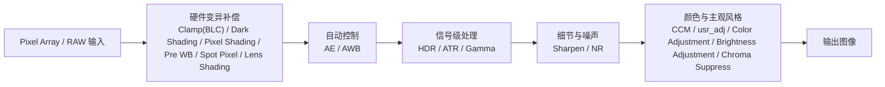

# ISX031_Pipeline

基于 [[raw/ISX031_ImageTuningManual_E_Rev.en_zh-CN.pdf]]、[[raw/ISX031_ApplicationNote_E_Rev1.zh-CN.pdf]] 和现有模块整理的 ISX031 图像处理 pipeline 说明，用于把平台内部的调试链路、模块顺序和观察重点串起来。

## 页面属性
- 类型：平台模块
- 厂家：Sony
- 平台：[[wiki/platforms/ISX031|ISX031]]
- 模块：图像处理 Pipeline
- 场景：平台整体链路理解、调试顺序梳理、模块定位
- 适用范围：指定平台

## 核心结论
- ISX031 不是只提供单个 sensor 输出，更像是带完整前级补偿、自动控制、HDR/亮度映射和后级风格调节链路的平台
- 从调优手册视角，整条 pipeline 可按四段理解：硬件变异补偿、自动控制、信号级处理、分辨率/降噪/颜色调节
- 调试时不要把所有问题都丢给后级颜色或锐化模块，很多问题会在前级补偿、AE/AWB 或 HDR/ATR/Gamma 阶段就已经定型

## Pipeline 总览

## 分段理解

### 1. RAW / Pixel Array 输入
- 起点是 sensor 采集到的原始图像信号
- 这一阶段还不能直接看主观画质，更多是后续各补偿链路和自动控制的输入基础
- 若输入端存在明显黑电平偏、列噪、坏点、镜头阴影或通道偏差，后级模块通常只能放大问题，不能根治

### 2. 硬件变异补偿链
对应模块：
- [[wiki/modules/ISX031_Clamp(BLC)|Clamp(BLC)]]
- [[wiki/modules/ISX031_Dark Shading Compensation|Dark Shading Compensation]]
- [[wiki/modules/ISX031_Pixel Shading Compensation|Pixel Shading Compensation]]
- [[wiki/modules/ISX031_Pre White Balance|Pre White Balance]]
- [[wiki/modules/ISX031_Spot Pixel Compensation|Spot Pixel Compensation]]
- [[wiki/modules/ISX031_Lens Shading Compensation|Lens Shading Compensation]]

作用可以先粗记成：
- 把 sensor、镜头和光学系统带来的固定偏差先打平
- 保证后续 AE、AWB、HDR、CCM 看到的是相对“可调”的输入

调试重点：
- 黑电平是否一致
- 边缘是否有明显亮度/颜色掉落
- 固定位置坏点、脏点、异常点是否被处理
- 各颜色通道基础响应是否已经明显偏掉

### 3. 自动控制链
对应模块：
- [[wiki/modules/ISX031_AE|AE]]
- [[wiki/modules/ISX031_AWB|AWB]]

作用可以先粗记成：
- 决定画面亮度目标、曝光时间、增益和白平衡落点
- 给后续 HDR、ATR、Gamma 和颜色风格链路提供稳定输入条件

调试重点：
- AE 是否把亮度控制在合理范围
- 测光窗口是否关注了正确主体
- AWB 是否稳定，是否会在典型光源间来回飘
- 若 AE / AWB 不稳定，后级再怎么调都容易反复失效

### 4. 信号级处理链
对应模块：
- [[wiki/modules/ISX031_HDR|HDR]]
- [[wiki/modules/ISX031_ATR|ATR]]
- [[wiki/modules/ISX031_Gamma|Gamma]]

这是 ISX031 最像“平台级 ISP”的部分。

#### HDR
- 负责宽动态合成
- 当前可按 `SP1_HCG -> SP1_LCG -> SP2H -> SP2L` 的三段融合去理解
- 主要决定不同亮度区间由哪一路信号接管，以及交界处是否连续

#### ATR
- 更偏主观亮暗层次与局部动态压缩
- 它会明显影响你对“亮不亮”“暗部有没有起来”“高光压得自不自然”的主观观感

#### Gamma
- 负责整体亮度映射和中低亮区域的视觉分布
- 它不直接创造动态范围，但会明显影响你怎么看到已经合成好的动态范围

这一段可以先粗记成：
- HDR 决定原始动态范围怎么拼
- ATR 决定亮暗层次怎么压
- Gamma 决定最终亮度曲线怎么呈现

调试重点：
- 大光比场景里高光是否保住
- 暗部有没有被拉灰或拉脏
- HDR 接缝有没有偏色、颗粒、断层
- ATR / Gamma 是否把本来合理的 RAW/HDR 结果又改坏了

### 5. 细节与噪声链
对应模块：
- [[wiki/modules/ISX031_Sharpen|Sharpen]]
- [[wiki/modules/ISX031_NR|NR]]

作用可以先粗记成：
- 处理主观清晰度和噪声观感
- 一个负责把边缘和纹理“立起来”，一个负责把随机噪声“压下去”

调试重点：
- 过强 NR 会涂抹、丢细节
- 过强 Sharpen 会假边、颗粒感、边缘发硬
- 这两个模块通常需要配套调，不要只单拉其中一个

### 6. 颜色与主观风格链
对应模块：
- [[wiki/modules/ISX031_CCM|CCM]]
- [[wiki/modules/ISX031_usr_adj|usr_adj]]
- [[wiki/modules/ISX031_Color Adjustment|Color Adjustment]]
- [[wiki/modules/ISX031_Brightness Adjustment|Brightness Adjustment]]
- [[wiki/modules/ISX031_Chroma Suppress|Chroma Suppress]]

作用可以先粗记成：
- 在基础正确的前提下，决定颜色还原、风格取向和最终主观观感
- 这里更多是在“修风格”和“修主观接受度”，而不是在“救基础错误”

调试重点：
- 颜色是基础不准，还是后级风格过头
- usr_adj 是否把局部颜色、饱和度、对比感推得太重
- Chroma Suppress 是否把颜色压得太脏或太灰

## 调试顺序建议
1. 先看前级补偿是否把基础问题处理干净
2. 再让 AE / AWB 稳定
3. 再处理 HDR / ATR / Gamma 的动态范围和亮暗层次
4. 最后才做 NR / Sharpen / CCM / usr_adj 这类主观画质调整

如果顺序反过来，常见结果是：
- 后级参数越调越多
- 某些场景好了，另一些场景更差
- 调完颜色才发现前面 AE / HDR 本身就不对

## 从问题反推 pipeline 的经验
- 偏色：先分清是 Pre WB / AWB / CCM / usr_adj 哪一段导致
- 高光过曝：先看 AE，再看 HDR，再看 ATR / Gamma
- 暗部发灰：先看 HDR / ATR / Gamma，再看 NR 是否把脏噪声抹成灰
- 拖影：先看 AE 快门策略，再看 HDR 多路合成是否带来动态副作用，再看 NR
- 假边：先看 Sharpen，再看前面 HDR / Gamma 是否把边缘对比已经拉过头

## 与调优流程页的关系
- 这页更偏“链路结构”和“模块在整条 pipeline 里的位置”
- [[wiki/workflows/ISX031_图像质量调整流程|ISX031_图像质量调试流程]] 更偏“实际调试时先后顺序”
- 两页最好配合使用：先用这页理解模块位置，再用流程页安排调参顺序

## 相关页面
- [[wiki/platforms/ISX031|ISX031]]
- [[wiki/workflows/ISX031_图像质量调整流程|ISX031_图像质量调试流程]]
- [[wiki/modules/ISX031_HDR|HDR]]
- [[wiki/modules/ISX031_AE|AE]]
- [[wiki/modules/ISX031_AWB|AWB]]
- [[wiki/modules/ISX031_NR|NR]]
- [[wiki/modules/ISX031_CCM|CCM]]

## 来源
- [[raw/ISX031_ImageTuningManual_E_Rev.en_zh-CN.pdf]]
- [[raw/ISX031_ApplicationNote_E_Rev1.zh-CN.pdf]]
- [[wiki/workflows/ISX031_图像质量调整流程|ISX031_图像质量调试流程]]

