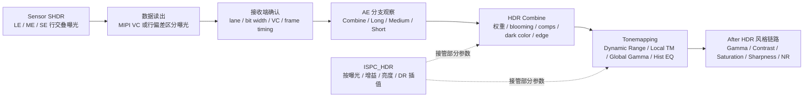

# SC121AT_HDR

SC121AT HDR 技术路线整理，用于把数据手册中的行交叠 HDR 输出、Tuning Tool 中的 AE 分支检查、HDR Combine、Tonemapping 和 ISPC_HDR 接管关系串成一条可调试链路。

## 页面属性
- 类型：平台模块
- 厂家：SmartSens / 思特威
- 平台：[[wiki/platforms/SC121AT|SC121AT]]
- 模块：HDR / Staggered HDR / Tonemapping / HDR Combine / ISPC_HDR
- 场景：高动态场景、逆光、车灯、隧道出入口、HDR 合成问题排查
- 适用范围：指定平台

## 核心结论
- SC121AT 的 HDR 主路线是行交叠 HDR（Staggered HDR, SHDR），不是普通多帧后处理 HDR。
- SHDR 在帧内逐行交替输出不同曝光时间图像，同一像素不同曝光的时间间隔较短，因此比普通多帧 HDR 更有利于减轻运动拖尾。
- SC121AT 最多支持三重曝光：长曝光 `LE`、中曝光 `ME`、短曝光 `SE`。
- 数据链路上先要解决“不同曝光数据如何被接收端区分”，再谈 ISP 里的合成和 tone mapping。
- 调试链路上先用 [[wiki/modules/SC121AT_AE|SC121AT_AE]] 查看 `Combine / Long_exp / Medium_exp / Short_exp` 分支，再决定问题属于曝光、合成、亮度映射还是 ISPC 自动插值接管。

## HDR 技术路线图

## 1. Sensor 侧：SHDR 输出路线

SC121AT 的 HDR 起点在 sensor 读出方式，而不是 Tuning Tool 的某个单独滑块。

- `LE`：Long Exposure，主要保暗部和低亮细节。
- `ME`：Median Exposure，承接中亮区域。
- `SE`：Short Exposure，主要保护高光和强反光区域。
- 两重曝光行交叠 HDR 可达到 100 dB。
- 三重曝光行交叠 HDR 可达到 120 dB。
- 典型能力：1280H x 960V @ 30fps @ 三重曝光行交叠 HDR。

### 输出区分方式

SC121AT 有两类 HDR 数据区分路线：

1. 使用 MIPI virtual channel 区分曝光数据。
2. 不使用 VC，通过长短曝光数据读出行偏差区分，并分为数据模式 a / b。

使用 VC 时，资料中给出的曝光分支映射是：

| 分支 | 含义 | VC |
|---|---|---|
| `LE` | 长曝光 | `2'b00` |
| `ME` | 中曝光 | `2'b01` |
| `SE` | 短曝光 | `2'b10` |

不使用 VC 时要格外确认接收端是否按行偏差、模式 a / b、dummy 行策略正确拆分曝光数据。否则后面看到的 HDR 异常可能不是 ISP 合成问题，而是输入分支已经错位。

### 关键寄存器入口

- `0x3281`：HDR mode enable，区分两重 / 三重行交叠 HDR 使能。
- `0x3e53 / 0x3e54`：`ME start point`。
- `0x3e23 / 0x3e24`：`SE start point`。
- `0x4853`：HDR VC enable。
- `0x4814`：LE VC。
- `0x4850`：ME VC。
- `0x4851`：SE VC。

这些寄存器更偏 bring-up 和接收链路确认。图像问题排查时，不要一开始就调 Tonemapping，先确认三路曝光是否真的按预期进入系统。

## 2. AE 侧：先看分支，再看合成

在 Tuning Tool 中，[[wiki/modules/SC121AT_AE|AE]] 页面提供 HDR 输出检查入口。

- `HDROutputFormat` 可选择 `Combine`、`Long_exp`、`Medium_exp`、`Short_exp`。
- `L/M`、`M/S` 表示当前长中曝光增益乘积比、中短曝光增益乘积比。
- 抓图格式选择 `HDR` 时，会抓取 `Combine`、长曝光、中曝光、短曝光四帧图像。

建议 HDR 问题先按这个顺序看图：

1. 看 `Long_exp`：暗部是否够亮、是否高增益噪声明显。
2. 看 `Medium_exp`：中亮区域是否承接自然。
3. 看 `Short_exp`：灯具、天空、反光区域是否保得住。
4. 看 `Combine`：如果单分支正常但 Combine 异常，再进入 HDR Combine 和 Tonemapping。

这样能避免把曝光比例问题误判成 tone mapping 问题，也能避免把接收端 VC 错配误判成 ISP 算法问题。

## 3. HDR Combine：三段曝光如何合成

HDR Combine 负责把长、中、短曝光数据融合成一路结果。Tuning Tool 中 Combine 下包含 `Combine Weight`、`Comps`、`Dark Color`、`Edge Tuning` 四类重点。

### Combine Weight

- `BloomingMode`：长中曝光中判断灯区 / blooming 区域的开关。
- `HighMargin`：饱和状态转折点，当原始信号值 + HighMargin > 224 时开始使用中曝光。
- `BloomingShift`：数值越小，爆闪灯区域修复越明显。
- `Hist1 0-2`：调整长中权重高频寄存器。
- `Hist2 0-2`：调整中短权重高频寄存器。

工程理解：

- 高光保不住，先看 `SE` 分支和 `HighMargin`。
- 灯区修复不自然，重点看 `BloomingMode` 和 `BloomingShift`。
- 合成边界不连续，优先看 `Hist1 / Hist2` 和曝光比例。

### Comps

- `Enable`：COMPS 使能。
- `CompSlope 0-7`：按亮度分 8 段线性压缩。
- 暗处斜率较大，用于保留更多暗部信息。
- 八段斜率必须递减。
- 斜率越大，画面相应越亮。

调试注意：

- Comps 最好对着太阳、天空、强反光等场景调。
- 天空 / 太阳四周不能出现明显亮度断层或大光晕。
- 暗部发灰时，不要只看 Gamma，也要检查 Comps 暗部斜率是否把暗部抬得过多。

### Dark Color

- `DarkColor`：深色检测开关，用于在长中曝光中检测类似警灯的深色区域。
- `ColorThre`：色彩阈值，当前点色彩大于该阈值时开启 DarkColor。
- `DarkColorExtent`：当前场景 DarkColor 功能开启程度。
- `DarkColorStartGain`：增益起始点，低于该增益时关闭。
- `DarkColorGainSpeed`：随增益增大开启的快慢。

它更像是特殊高反差/警灯场景的保护项，不建议在普通亮度层次问题里优先动。

### Edge Tuning

- `Enable`：边缘优化开关。
- `EdgeThre`：边缘阈值，值越小越容易带来噪声。
- `Strength`：边缘优化强度，值越大越强。
- `Black Edge`：黑边优化开关。
- `Manual`：手动设置黑边阈值开关。
- `ManualThre`：手动黑边最大阈值。
- `Limit Factor`：黑边限制系数，值越大，黑边阈值越大。
- `Max Thre`：黑边最大阈值，值越大黑边可能越严重。
- `Min Thre`：黑边最小阈值。

假边、黑边、强反差边缘异常时，先看 HDR Combine 的 Edge Tuning，再看 [[wiki/modules/SC121AT_Sharpness|SC121AT_Sharpness]]。如果顺序反了，容易用锐化去掩盖合成边界问题。

## 4. Tonemapping：合成后如何压缩到好看的亮度层次

Tonemapping 模块分为 `Dynamic Range`、`Local Tonemapping`、`Global Gamma`、`Hist EQ` 四部分。

### Dynamic Range

- `Current Dynamic Range`：当前动态范围值，可实时更新。
- `Dynamic Range0~3`：按动态范围划分不同段，应用不同参数。
- 分段插值会影响 `MaxGamma`、`MinGamma`、`GlobalGamma`、`LocalGammaAlpha`、`LocalGammaStep`、`CurveAlpha`、`HistPointStep`。

它是 HDR 自动风格变化的主轴。排查时要记录当前 DR 落在哪一段，否则同一套参数在不同动态范围场景下表现会不一致。

### Local Tonemapping

Local gamma 会参考平均亮度，将亮区压暗、暗区抬亮，用于减弱光晕、增加整体对比度。

- `LocalTMEnable`：Local Tonemapping 开关。
- `MaxGamma 0~3`：按动态范围分段，对应 local gamma 最小值。
- `MinGamma 0~3`：按动态范围分段，对应 local gamma 最大值。
- `Local Gamma Alpha 0~3`：强度值，数值越小强度越高。
- `LTMAlpha2`：控制降低 Local Gamma Alpha 的值，从而降低亮度。
- `Local Gamma Step 0~3`：控制帧与帧之间过渡，越大过渡越快。
- `LocalShift`：控制 local tonemapping 过渡区域，越大过渡区域越宽。

风险点：

- 提升 LTM 强度可能恶化 ghost 和噪声。
- 暗部发灰、涂抹感、动态边缘拖影都可能被过强 LTM 放大。

### Global Gamma 与 Hist EQ

- `Global Gamma` 作用于全局，可整体抬亮，数值越小强度越高。
- `Hist EQ` 用于提高对比度、调整亮度。
- `HistPointStep` 控制直方图统计帧间过渡步长。
- `CurveAlpha` 控制整体直方图均衡强度。

这两类更偏最终观感，不应该替代曝光比例和 Combine 修正。若高光已经饱和，Gamma / Hist EQ 只能改变观感，不能恢复不存在的细节。

## 5. ISPC_HDR：自动插值与控制权接管

启用 [[wiki/modules/SC121AT_ISPC_Controller|ISPC_HDR]] 后，HDR 页面中对应开启的小模块会失效，显示值变为 ISPC 插值结果。

ISPC_HDR 可接管或插值的典型项目包括：

- `Max Gamma`
- `Global Gamma`
- `Local Gamma Alpha`
- `Curve Alpha`
- `High Margin`
- `AWB Luma Low Th`
- `AE Target`
- `Comps`

ISPC_HDR 的核心输入是 `Int Gain Luma`：

- 通过 `IntL`、`GainL`、`LumaL` 计算 DR 值。
- 根据 `int_gain_luma` 在 `Dy Th1~4` 不同区间对 HDR 参数做插值。
- `HDR_Para` 使用四段参数插值，`Out` 为实际输出结果。

调试原则：

1. 如果 HDR / AE 页面中参数修改无效，先检查 ISPC_HDR 是否开启。
2. 如果场景切换时亮度跳变，检查 `Dy Th1~4`、`Local Gamma Step` 和各段 Out 值。
3. 如果量产要用自动插值，必须记录当前生效值，而不是只记录手动页面上的设定值。

## 6. 推荐调试路线

1. 先确认接收链路：MIPI / DVP / LVDS、位宽、lane、VC、帧率和输出格式。
2. 确认 SHDR 模式：两重或三重 HDR、`0x3281`、`ME / SE start point`、VC enable 与 VC 映射。
3. 在 AE 页面抓 `Long_exp / Medium_exp / Short_exp / Combine` 四帧。
4. 若单分支已经异常，先回到曝光时间、增益、AE target、L/M 和 M/S 比例。
5. 若单分支正常但 Combine 异常，再调 `Combine Weight`、`Comps`、`Dark Color`、`Edge Tuning`。
6. 若 Combine 结果层次不顺，再调 `Dynamic Range`、`Local Tonemapping`、`Global Gamma`、`Hist EQ`。
7. 若参数修改不生效或随场景自动变化，检查 ISPC_HDR 控制权和 Out 结果。
8. 最后再处理后级风格：[[wiki/modules/SC121AT_Gamma|Gamma]]、Contrast、[[wiki/modules/SC121AT_Saturation|Saturation]]、[[wiki/modules/SC121AT_Sharpness|Sharpness]]、[[wiki/modules/SC121AT_NR|NR]]。

## 常见问题映射

| 问题 | 优先检查 |
|---|---|
| [[wiki/issues/高光过曝|高光过曝]] | `SE` 分支、L/M 和 M/S 比例、`HighMargin`、`BloomingShift`、Comps 高亮段、Global / Local Gamma |
| [[wiki/issues/暗部发灰|暗部发灰]] | `LE` 分支、Comps 暗部斜率、Local Tonemapping、Global Gamma、Hist EQ、黑位和 LSC |
| 光晕 | LTM 强度、Comps 分段斜率、Blooming 参数、Hist EQ 强度 |
| [[wiki/issues/拖影|拖影]] | SHDR 曝光比例、三分支时间差、Combine 前后差异、过强 LTM |
| [[wiki/issues/假边|假边]] / 黑边 | Edge Tuning、Black Edge、Hist1 / Hist2、后级 Sharpness |
| [[wiki/issues/噪声大|噪声大]] | `LE` 增益、LTM 抬暗、Comps 暗部斜率、NR 分曝光类型设置 |
| [[wiki/issues/亮度不自然|亮度不自然]] | Dynamic Range 分段、Local Gamma Alpha、Global Gamma、Hist EQ、ISPC_HDR Out |

## 相关页面
- [[wiki/modules/SC121AT_AE|SC121AT_AE]]
- [[wiki/modules/SC121AT_ISPC_Controller|SC121AT_ISPC_Controller]]
- [[wiki/modules/SC121AT_Gamma|SC121AT_Gamma]]
- [[wiki/modules/SC121AT_NR|SC121AT_NR]]
- [[wiki/modules/SC121AT_Sharpness|SC121AT_Sharpness]]
- [[wiki/workflows/SC121AT_图像质量调整流程|SC121AT_图像质量调试流程]]
- [[wiki/issues/高光过曝|高光过曝]]
- [[wiki/issues/暗部发灰|暗部发灰]]
- [[wiki/issues/假边|假边]]
- [[wiki/issues/拖影|拖影]]

## 来源
- [[raw/SC121AT_数据手册_V0.1(2).pdf]]
- [[raw/sc121at_ISP_Tuning_Tool使用指南_V1.2.pdf]]

