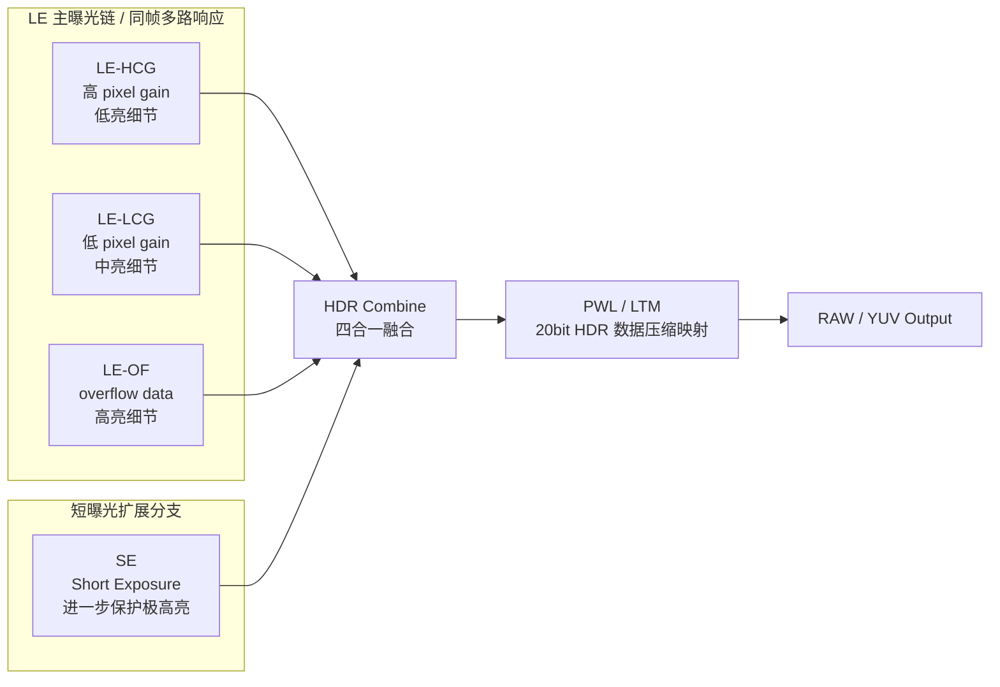

# SC361AT_HDR

基于 [[raw/SC361AT-00_数据手册_V1.0.pdf]] 当前可提取内容整理的 SC361AT HDR 路线图，重点用于理解 HCG / LCG / OF / SE 在 HDR 合成链中的角色。

## 页面属性
- 类型：平台模块
- 厂家：SmartSens
- 平台：[[wiki/platforms/SC361AT|SC361AT]]
- 模块：HDR 成像
- 场景：平台 HDR 技术路线理解、调试入口梳理
- 适用范围：指定平台

## 核心结论
- SC361AT 支持 `PixGain HDR` 和 `Lofic HDR`
- 当前资料显示其 HDR 不是单一“大/小像素”路线，而是 `HCG`、`LCG`、`OF`、`SE` 等多路数据共同参与 HDR 合成
- `HCG / LCG / OF` 更像同时刻的多路响应数据
- `SE` 是短曝光分支，用于进一步扩展高亮动态范围
- 合成后还会经过 `PWL / LTM` 进行压缩映射，再输出 RAW 或 YUV 数据

## “四合一 / 四帧融合”怎么理解
- datasheet 里写到 `140 dB @ 四帧融合`，并且说明 `PWL` 会把“四帧融合之后的 20bit 图像”映射到 12bit
- 结合 `PixGain HDR`、`Lofic HDR`、`HCG / LCG / OF / SE`、`LE / SE` 的描述，当前更稳妥的工程化理解是：这里的“四合一”指 HDR 最终融合时有四路主要输入参与，而不是只看成普通意义上四张独立照片
- 按当前资料，最容易理解成下面四路：
  1. `LE-HCG`：长曝光链的高 pixel gain 数据，主要保低亮细节
  2. `LE-LCG`：长曝光链的低 pixel gain 数据，主要保中亮细节
  3. `LE-OF`：长曝光链的 overflow 数据，主要保高亮细节
  4. `SE`：短曝光分支，进一步保护极高亮区域
- 其中前 3 路更接近 `Lofic / PixGain` 体系里的同帧多路响应，最后 1 路是额外的短曝光扩展分支
- 所以从调试视角看，SC361AT 可以先粗记成：`三路同帧响应 + 一路短曝光 = 四合一 HDR`

## HDR 信号路线示意图

## 图示理解
- `LE-HCG` 主要保低亮区域的细节和信噪比
- `LE-LCG` 主要承接中亮区域并提升抗饱和能力
- `LE-OF` 主要保高亮区域细节，是 Lofic 路线的重要组成部分
- `SE` 作为短曝光分支，帮助进一步扩展极高亮区域的动态范围
- `HDR Combine` 是四路数据融合节点
- `PWL / LTM` 用于把融合后的高位宽 HDR 数据压缩映射到后续输出位宽

## 调试视角下的理解
- 若主要问题出现在暗部噪声，优先关注 `LE-HCG` 路是否工作正常
- 若中亮区域容易断层或发灰，优先检查 `LE-LCG` 与 HDR 合成策略
- 若高光保不住，重点看 `LE-OF` 和 `SE` 路是否有效参与合成
- 若整体亮度层次不自然，除 HDR 合成本身外，还要回看 `PWL / LTM` 的压缩映射策略

## 常见问题入口
- [[wiki/issues/高光过曝|高光过曝]]：重点看 `LE-OF`、`SE` 是否有效参与合成，并联查 [[wiki/modules/SC361AT_AEC_AGC|SC361AT_AEC_AGC]] 与 [[wiki/modules/SC361AT_PWL|SC361AT_PWL]]。
- [[wiki/issues/暗部发灰|暗部发灰]]：重点看 `LE-HCG` / `LE-LCG`、HDR 合成后映射和 PWL / LTM 是否抬暗过度。
- [[wiki/issues/噪声大|噪声大]]：重点看低照 gain、`LE-HCG` 信噪比、HDR 合成权重和后级映射是否放大噪声。
- [[wiki/issues/假边|假边]]：重点看高反差边缘处 HCG / LCG / OF / SE 合成切换是否自然。

## 说明
- 该图是按调试视角整理的路线示意图，不等同于厂商完整内部电路框图
- 当前结论主要依据 datasheet 中对 `PixGain HDR`、`Lofic HDR`、`OF`、`SE/LE`、`PWL` 的描述进行抽象
- datasheet 没有在当前可见段落里直接逐字写出“四合一 = LE-HCG + LE-LCG + LE-OF + SE”，这是基于现有描述做的最合理工程化归纳

## 来源
- [[raw/SC361AT-00_数据手册_V1.0.pdf]]
